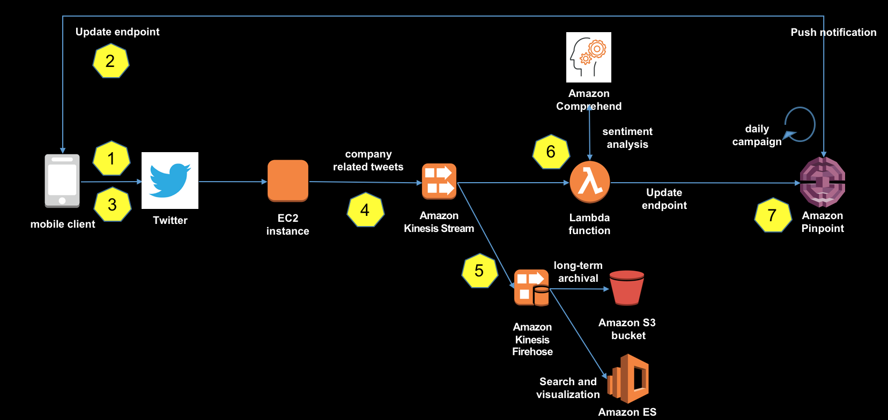
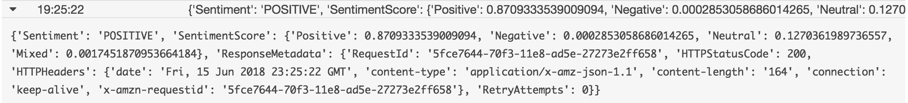
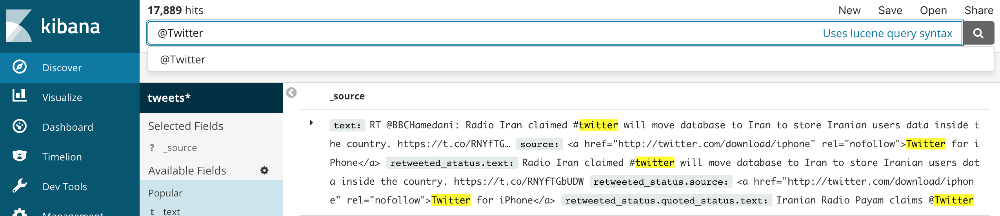
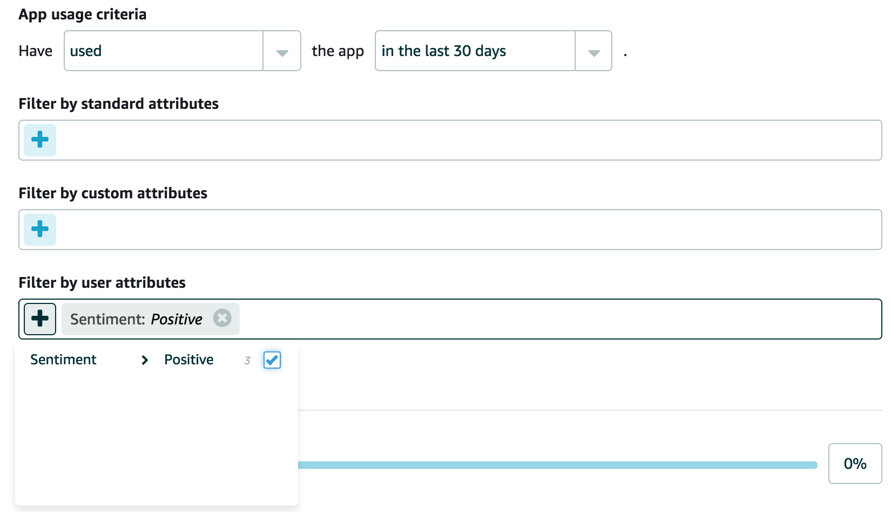

## Amazon Pinpoint Social Sentiment

Use machine learning to understand social media user sentiment and create marketing campaigns to engage promoters and detractors.

## Use Case
Imagine you are a brand with a large web and mobile presence. You want to monitor the conversation around your brand on social media and message your promoters/influencers and detractors across multiple channels. AWS and Pinpoint provide a great foundation for doing so easily and at massive scale. 

## Architecture


## Prerequisites

You need the following:

* A mobile app that uses Twitter's APIs and/or SDK for authentication and tweet ingestion
* A macOS-based computer and physical iOS device (the Simulator that's included with Xcode isn't sufficient for testing this solution). 
* Xcode, Node.js, npm and CocoaPods installed on your macOS-based computer.
    * To download Xcode, see https://developer.apple.com/download/.
    * To download Node.js and npm, see https://nodejs.org/en/. Download the latest Long-Term Support (LTS) version for macOS.
    * Install CocoaPods via the Mac terminal with `sudo gem install cocoapods`
* The AWS Command Line Interface (AWS CLI) installed and configured on your macOS-based computer. For information about installing the AWS CLI, see [Installing the AWS Command Line Interface](https://docs.aws.amazon.com/cli/latest/userguide/installing.html). For information about setting up the AWS CLI, see [Configuring the AWS CLI](https://docs.aws.amazon.com/cli/latest/userguide/cli-chap-getting-started.html).
* An AWS account with sufficient permissions to create the resources shown in the diagram in the earlier section. For more information about creating an AWS account, see [How do I create and activate a new Amazon Web Services account?](https://aws.amazon.com/premiumsupport/knowledge-center/create-and-activate-aws-account/).
* An Amazon EC2 key pair. You need this to log into the EC2 instance if you want to modify the Twitter handle that you're monitoring. For more information, see [Creating a Key Pair Using Amazon EC2](https://docs.aws.amazon.com/AWSEC2/latest/UserGuide/ec2-key-pairs.html#having-ec2-create-your-key-pair).
* An [Apple Developer](https://developer.apple.com/) account. Note that the approach that we cover in this post focuses exclusively on iOS devices. You can implement this solution on Android devices.

### Setup
#### Step 1: Create a Twitter application

The first step in this process is to create a Twitter app, which gives you access to the Twitter API. This solution uses the Twitter API to collect tweets in real-time.

To create a Twitter application:

1. Log into your Twitter account. If you don't already have a Twitter account, create one at https://twitter.com/signup.
2. Go to https://apps.twitter.com/app/new, and then choose *Create a new application*.
3. Under *Application Details*, complete the following sections:
    1. For *Name*, type the name of your app.
    2. For *Description*, type a description of your app. 
    3. For the *Website* and *Callback URL* fields, type any fully qualified URL (such as https://www.example.com). You'll change these values in a later step, so the values you enter at this point aren't important.
4. Choose *Create your Twitter application*.
5. Under *Your access token*, choose *Create your access token*.
6. Under *Application type*, choose *Read Only*.
7. Under *Oauth settings*, note the values next to *Consumer key* and *Consumer secret*. Then, under *Your access token*, note the values next to *Access key* and *Secret access key*. You'll need all of these values in later steps.

#### Step 2: Install the Dependencies

This solution requires you to download and set up some files from a GitHub repository. 

*To configure the AWS Mobile SDK in your app:*

1. Open Terminal.app. On the command line, navigate to the directory where you want to create your project. 
2. On the command line, type the following command to clone this repository: `git clone https://github.com/aws-samples/amazon-pinpoint-social-sentiment`
3. Type the following command to change into the directory that contains the installation files:  `cd amazon-pinpoint-social-sentiment/mobile`
4. Type the following command to download the dependencies for this solution: `npm install`
5. Type the following command to link the dependencies in the project: `react-native link` 
6. Change into the ios directory:  `cd ios`
7. Retrieve and install CocoaPods into your project specified in the Podfile: `pod install`

#### Step 3: Set Up Your App to use the AWS Mobile SDK

To configure your app:

1. From the `/mobile` directory, type the following command to create a backend project for your app and pull the service configuration (`aws-exports.js` file) into your project: `awsmobile init`

Press Enter at each prompt to accept the default response, as shown in the following example.
```
Please tell us about your project:
? Where is your project's source directory: /
? Where is your project's distribution directory that stores build artifacts: /
? What is your project's build command: npm run-script build
? What is your project's start command for local test run: npm run-script start
? What awsmobile project name would you like to use: mobile-2018-06-20-03-16-39
```

2. Open the file `aws-exports.js`. This file contains information about the backend configuration of your AWS Mobile Hub project. Take note of the `aws_mobile_analytics_app_id` key—you'll use this value in a later step.
3. In a text editor, open the file `amazon-pinpoint-social-sentiment/mobile/App.js`. Under `TwitterAuth.init`, next to twitter_key, replace `<your key here>` with the consumer key that you received when you created your Twitter app in Step 1. Then, next to `twitter_secret`, replace `<your secret here>` with the Consumer Secret you received when you created your Twitter app. When you finish, save the file.
4. In a text editor, open the file `amazon-pinpoint-social-sentiment/mobile/ios/MobileCon/AppDelegate.m`. Search for the following section: 
```
- (BOOL)application:(UIApplication *)application didFinishLaunchingWithOptions:(NSDictionary *)launchOptions
{
  NSURL *jsCodeLocation;

  [[Twitter sharedInstance] startWithConsumerKey:@"<your-consumer-key>" consumerSecret:@"<your-consumer-secret>"];
```
In this section, replace `<your-consumer-key>` with your Twitter consumer key, and replace `<your-consumer-secret>` with your Twitter consumer secret.

5. In a text editor, open the file `amazon-pinpoint-social-sentiment/mobile/ios/MobileCon/Info.plist`. Search for the following section: 
```
<key>CFBundleURLTypes</key>
    <array>
        <dict>
            <key>CFBundleURLSchemes</key>
            <array>
                <string>twitterkit-<your-API-key></string>
            </array>
        </dict>
    </array>
```
Replace `<your-API-key>` with your Twitter Consumer Secret.

#### Step 4: Set up push notifications in your app

Now you're ready to set up your app to send push notifications. A recent [Medium post](https://medium.com/react-native-training/react-native-push-notifications-with-amazon-pinpoint-ios-b2efa89ced32) from AWS Developer Advocate Nader Dabit outlines this process nicely. Start at the *Apple Developer Configuration* section, and complete the remaining steps. After you complete these steps, your app is ready to send push notifications.

#### Step 5: Launch the AWS CloudFormation template

While your app is building, you can launch the AWS CloudFormation template that sets up the backend components that power this solution.

To launch the AWS CloudFormation template:

1. Sign in to the AWS Management Console, and then open the AWS CloudFormation console at https://console.aws.amazon.com/cloudformation/home?region=us-east-1. 
2. Use the region selector in the upper right to ensure that *US East (N. Virginia)* is the selected region.
3. Choose *Create new stack*.
4. Next to *Choose a template*, choose *Specify an Amazon S3 template URL*, and then paste the following URL: https://github.com/aws-samples/amazon-pinpoint-social-sentiment/blob/master/cloudformation/twitterdemo.template.yaml. Choose *Next*.
5. Under *Specify Details*, for *Stack Name*, type a name for the CloudFormation stack.
6. Under *Parameters*, do the following:
    1. For *AccessToken*, type your Twitter access token. 
    2. For *SecretAccessToken*, type your Twitter access token secret.
    3. For *AppId*, type the app ID that you obtained in Part 3.
    4. For *ConsumerKey*, type your Twitter consumer key.
    5. For *ConsumerSecret*, type your Twitter consumer secret.
7. Choose *Next*. 
8. On the next page, review your settings, and then choose *Next* again. On the final page, select the box to indicate that you understand that AWS CloudFormation will create IAM resources, and then choose *Create*.

When you choose *Create*, AWS CloudFormation creates the all of the backend components for the application. These include an EC2 instance, a Kinesis data stream, a Kinesis Firehose delivery stream, an S3 bucket, an Elasticsearch cluster, and a Lambda function. This process takes about 10 minutes to complete. 

#### Step 6: Send a test tweet

Now you're ready to test the solution to make sure that all of the components work as expected.

Start by logging in to your Twitter account. Send a tweet to `@awsformobile`. Your tweet should contain language that has a strongly positive sentiment. 

Your EC2 instance, which monitors the Twitter streaming API, captures this tweet. When this happens, the EC2 instance uses the Kinesis data stream to send the tweet to an Amazon S3 bucket for long-term storage. It also sends the tweet to AWS Lambda, which uses Amazon Comprehend to assign a sentiment score to the tweet. If the message is positive, Amazon Pinpoint sends a push notification to the Twitter handle that sent the message.  

You can monitor the execution of the Lambda function by using CloudWatch Logs. You can access CloudWatch Logs at https://console.aws.amazon.com/cloudwatch/home?region=us-east-1#logs:. The log should contain an entry that resembles the following example:

In the above screen shot, you can see the sentiment score that Amazon Comprehend provides, in this case an 87.1% positive tweet. 

On the Amazon Elasticsearch Service (Amazon ES) console, you can watch as Amazon ES catalogs incoming tweets. You can access this console at https://console.aws.amazon.com/es/home?region=us-east-1. In the Amazon ES domain called “tweets”, choose the Kibana URL. You can use Kibana to easily search your incoming tweets, as shown in the following image:

Finally, you can go to your Amazon S3 bucket to view an archive of the tweets that were addressed to you. This bucket is useful for simple archiving, additional analysis, visualization, or even machine learning. You can access the Amazon S3 console at https://s3.console.aws.amazon.com/s3/home?region=us-east-1#.

#### Step 7: Create an Amazon Pinpoint campaign

In the real world, you probably don't want to send messages to users immediately after they send tweets to your Twitter handle—if you did, you might seem too aggressive, and your customers might hesitate to engage with your brand in the future.

Fortunately, you can use the campaign scheduling tools in Amazon Pinpoint to create a recurring campaign. When you create a recurring campaign, Amazon Pinpoint sends messages only to customers who meet certain criteria at campaign execution. Additionally, you can schedule your messages to be sent at a specific time in each recipient's time zone.

*Important*: You have to obtain consent from your customers before you send messages to them.

1. Log in to the AWS console, and then open the Amazon Pinpoint console at https://console.aws.amazon.com/pinpoint/home/?region=us-east-1.
2. On the *Projects* page, choose your app.
3. In the navigation pane, choose *Campaigns*, and then choose *New Campaign*.
4. For *Campaign name*, type a name for the campaign, and then choose *Next step*.
5. On the *Segment* page, do the following
    1. Choose *Create a new segment*.
    2. For *Name your segment to reuse it later*, type a name for the segment.
    3. For *Filter by user attributes*, choose the plus sign (+) icon. Filter by segment to include all endpoints where *Sentiment* is *Positive*, as shown in the following image:
    
    4. Choose *Next step*.


6. On the *Message* page, type the message that you want to send, and then choose *Next step*. To learn more about writing mobile push messages, see [Writing a Mobile Push Message](https://docs.aws.amazon.com/pinpoint/latest/userguide/campaigns-message.html#campaigns-message-mobile) in the Amazon Pinpoint User Guide.
7. On the *Schedule* page, choose the date and time when the message will be sent. You can also schedule the campaign to run on a recurring basis, such as every week. To learn more about scheduling campaigns, see [Set the Campaign Schedule](https://docs.aws.amazon.com/pinpoint/latest/userguide/campaigns-schedule.html) in the Amazon Pinpoint User Guide.


## Troubleshooting
1. Push notifications aren't sending.
    * Did you allow permissions for push notifications on the first app launch?
    * Did the Kinesis producer script crash? Log into EC2 instance and view logs to troubleshoot.
    * Sometimes, the Twitter Stream API decides not to monitor certain Twitter accounts. Twitter does not publish their criteria for which accounts are unmonitored and why. Create a new Twitter account and its tweets should show up on the stream.
    * Did you have poor connectivity when you launched the app for the first time? Try force backgrounding/force quitting the app and restarting a few times.
    * If all else fails, consult Apple's push notification troubleshooting guide [here](https://developer.apple.com/library/content/technotes/tn2265/_index.html). 
2. I'm getting more than one push!
    * This can happen if the Lambda fails unexpectedly. Exceptions should be handled apppropriately but troubleshooting for this can be done within provided Lambda funciton. 

## License Summary

This sample code is made available under a modified MIT license. See the LICENSE file.
